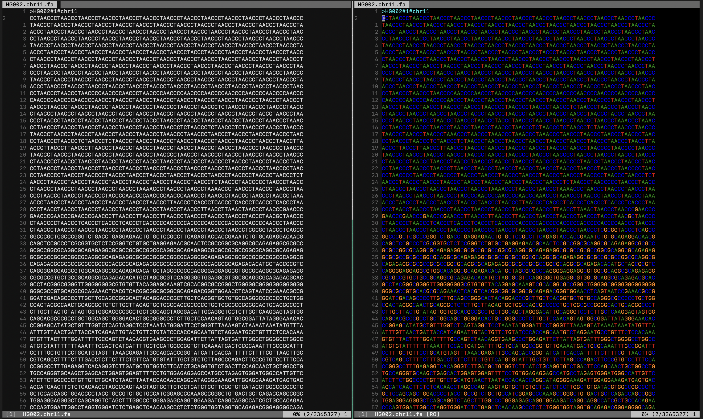
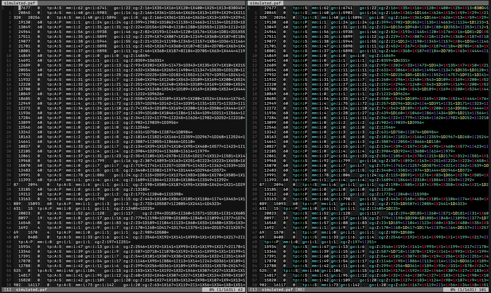

dna.vim is a plugin to aid visual parsing of sequencing files (e.g., SAM, PAF, anything with a DNA sequence in it). Current features:

1. A/C/G/T are colored (consistent with IGV colors)
2. Using the commands `:SAM`, `:BAM`,`:GAF`, or `:PAF` in their respective files will tell you the description of the field your cursor is hovering over (e.g., using `:SAM` in column 2 of a SAM/BAM file will print a message along the lines of "FLAG: 2064 -- supplementary alignment, reverse strand")
3. Operation blocks within CIGAR strings are colored separately from each other
4. Sequence names in FASTA/FASTQ files are colored

# Screenshots






# Usage

Copy dna.vim into your ~/.vim/plugin/ directory. The plugin will automatically trigger for files with the following extensions: .sam, .paf, .fasta, .fa, .fastq, .fq, .gaf, .gfa

You can also toggle the highlighting by using the command `:DNA`. For example, to view .bam files, you can view the file with `samtools view file.bam | vim -` and then apply `:DNA` inside vim.

There are also file-specific commands (`:SAM`, `:GAF`:, or `:PAF`) that will print the description of the field the cursor is hovering over. The field descriptions are pulled from each file type's specification. For example, using `:SAM` in column 1 of a SAM/BAM file will print "QNAME: Query template NAME". Using `:SAM` in the flag field will also decode the flag (e.g., "FLAG: 2064 -- supplementary alignment, reverse strand").

# Performance

The line `setlocal synmaxcol=9000` limits how far into a line the syntax matching will search. The value 9000 works well for the files I work with, but if the rendering is too slow, you can reduce lag by lowering the value.

# More Precise Matching

The default syntax matching is simple—every A/C/G/T will be colored regardless of context (e.g., the G in HG002 would also be colored). You can implement more careful matching with something like the following, which only highlights bases if they are adjacent to another A/C/G/T:

```
# checks if the character is adjacent to A/C/G/T
call s:DefineHighlight('Adenine', '\([ACGT]\)\@<=A\|A\([ACGT]\)\@=', '#009600', 28)

# default pattern that just checks for A
call s:DefineHighlight('Adenine', 'A', '#009600', 28)
```

However, the trade-off is that the more precise matching is slower. Since the capital A/C/G/T don't appear too often in sequencing files outside of DNA sequences, the plugin uses the faster simple matching.
